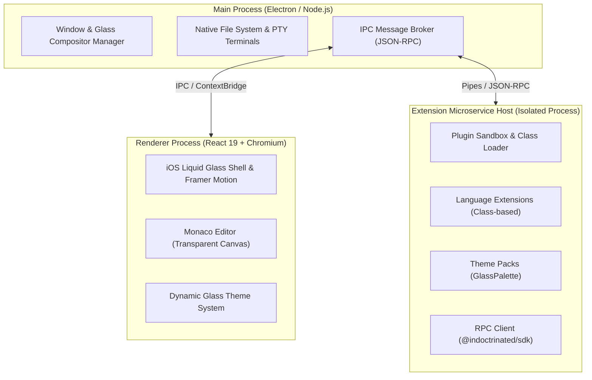

# ✨ IndoctrinatedEdit

> *Crafted with passion by **[indoctrinatedrecluse](https://github.com/indoctrinatedrecluse)*** ❤️✨

---

### 🔗 Sister Project

> **Looking for our ultra-lightweight Windows counterpart?**  
> Check out **[RecluseEdit](https://github.com/indoctrinatedrecluse/RecluseEdit)** — a lightning-fast, ultra-lean web application code editor crafted with WPF, C#, and .NET 10.

---

## 🌟 Overview & Vision

**IndoctrinatedEdit** is a hyper-modern, flashy, general-purpose desktop text and code editor built for both **Linux** and **Windows**. 

Where its sister project **RecluseEdit** focuses on an ultra-minimal footprint and lightweight Windows native execution, **IndoctrinatedEdit** flips the equation: bundle size is unconstrained, performance is GPU-accelerated, and visual aesthetics take center stage. Built with a signature **iOS "Liquid Glass"** frosted aesthetic, physics-based fluid spring animations, and an uncompromised multi-process microservices extension architecture, IndoctrinatedEdit delivers a desktop editing experience that feels genuinely alive.

---

## 🎯 Key Architectural Pillars

- 🪟 **The "Liquid Glass" Aesthetic**: Multi-layered hardware-accelerated frosted glass (`backdrop-filter: blur()`), dynamic specular rim lighting, subtle ambient glow shaders, and authentic Apple-grade spring physics powered by Framer Motion.
- ⚡ **Heavyweight Text Engine (Monaco Editor)**: Integrates the battle-tested editor core of VS Code — offering multi-cursor editing, minimap, rich diff views, bracket pair colorization, parameter hints, code folding, and native Language Server Protocol (LSP) support for 80+ programming languages.
- 🧩 **Microservices & Isolated Plugin Model**: Extensions and themes do not run on the main UI thread. A dedicated, out-of-process **Extension Host** executes community plugins in sandboxed child processes over high-speed typed JSON-RPC, ensuring plugins can never freeze or crash the user interface.
- 🎨 **First-Class Class-Based Theme & Extension SDK**: A clean, typed API (`@indoctrinated/sdk`) where community developers create custom themes, syntax providers, inline autocompletion microservices, and status bar contributions by implementing well-defined classes.
- 🐧🪟 **Complete Linux & Windows Parity**: Identical visual presentation, glass shader rendering, and keyboard shortcut behaviors across modern Linux desktop environments (Wayland & X11) and Windows 10/11.

---

## 🛠️ Technology Stack

| Layer | Technology |
| :--- | :--- |
| **Desktop Shell / Host** | [Electron](https://www.electronjs.org/) + Node.js |
| **Frontend UI Framework** | [React 19](https://react.dev/) + [TypeScript](https://www.typescriptlang.org/) |
| **Editor Core Engine** | [Monaco Editor](https://microsoft.github.io/monaco-editor/) |
| **Animation & Motion Physics** | [Framer Motion](https://www.framer.com/motion/) |
| **UI Primitives & Icons** | [Radix UI](https://www.radix-ui.com/) & [Lucide Icons](https://lucide.dev/) |
| **Styling Engine** | Vanilla CSS Glassmorphism Design System (Backdrop Filters, Specular Lights, CSS Tokens) |
| **Extension Microservice Bus** | Out-of-process Node.js Child Process Host + Typed JSON-RPC |
| **Build & Bundling Toolchain** | [Vite](https://vitejs.dev/) + Electron Builder / Vite Plugin Electron |

---

## 🏗️ Architecture Overview

---

## 📐 Project Scope & Roadmap

### Phase 1: Shell & Liquid Glass Design System
- [ ] Electron + Vite + React 19 workspace scaffolding.
- [ ] Frameless window with transparent composition on Windows 10/11 and Linux.
- [ ] Liquid Glass design system (multi-stage blur, specular borders, noise texture, and spring physics).
- [ ] Custom window frame, title bar, tabs manager, and collapsible glassy panels.

### Phase 2: Monaco Editor Integration & Custom Glass Canvas
- [ ] Transparent Monaco Editor integration with theme synchronization.
- [ ] Floating glassy hover cards, parameter hints, and autocomplete widgets.
- [ ] Minimap, line numbers gutter, and diagnostic squiggle rendering.

### Phase 3: Extension & Themes Microservice Architecture
- [ ] Core SDK (`@indoctrinated/sdk`) exposing class-based contracts:
  - `ExtensionPlugin`
  - `ThemeDefinition` & `GlassPalette`
  - `InlineCompletionProvider`
  - `StatusBarProvider`
  - `ToolchainCheck`
- [ ] Isolated out-of-process Extension Host daemon.
- [ ] Bidirectional JSON-RPC communication bus and capability permissions.

### Phase 4: Integrated Developer Tooling & Terminals
- [ ] Glassy multi-tab terminal dock powered by `xterm.js` and `node-pty`.
- [ ] Universal Command Palette (<kbd>Ctrl+Shift+P</kbd> / <kbd>F1</kbd>) with fuzzy search.
- [ ] File tree explorer with live file system watchers.

---

## 📜 Author & License

Developed and maintained by **[indoctrinatedrecluse](https://github.com/indoctrinatedrecluse)**.  
All rights reserved.
